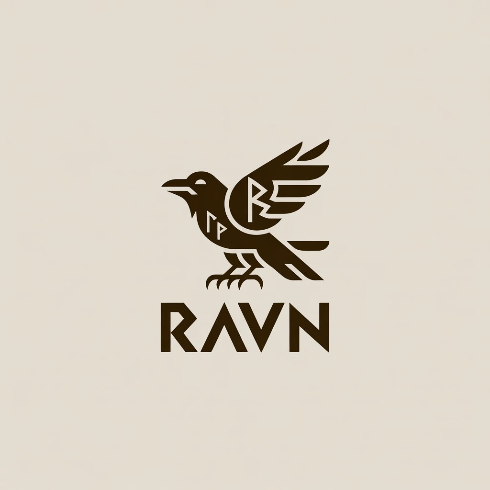
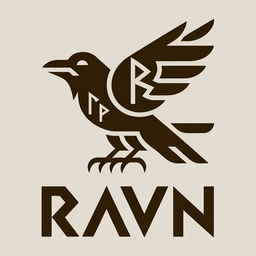
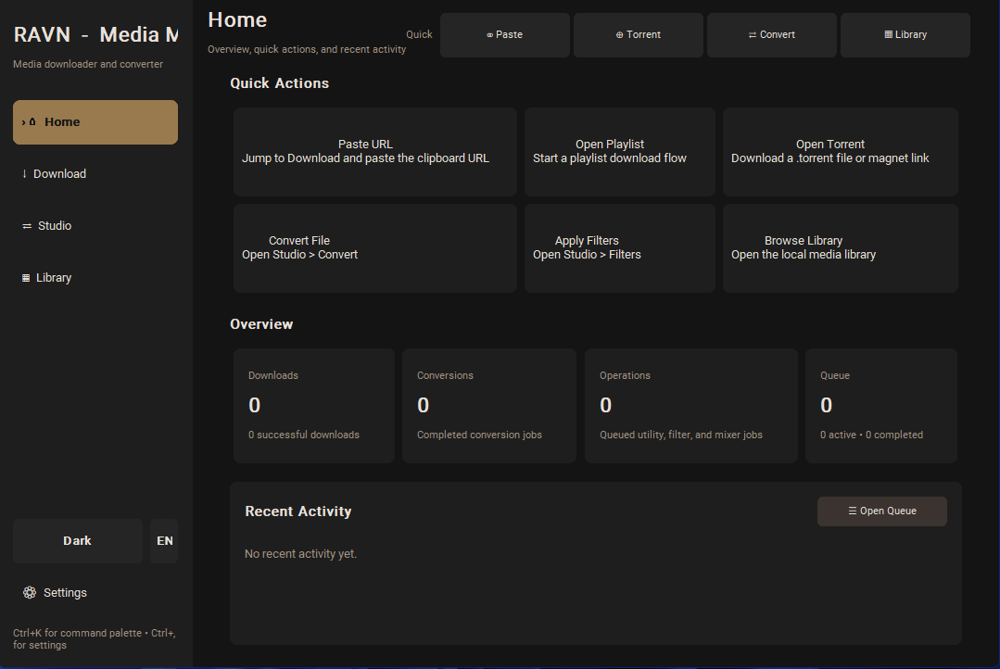
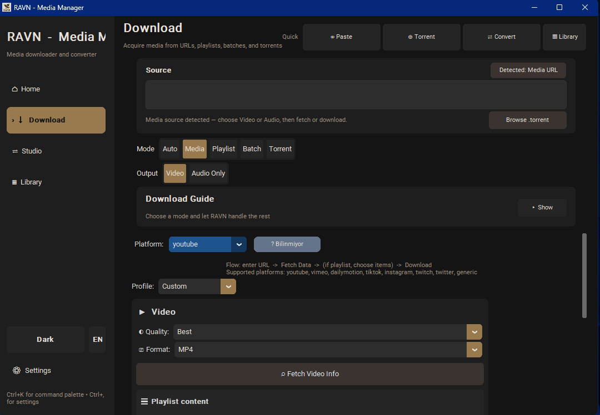
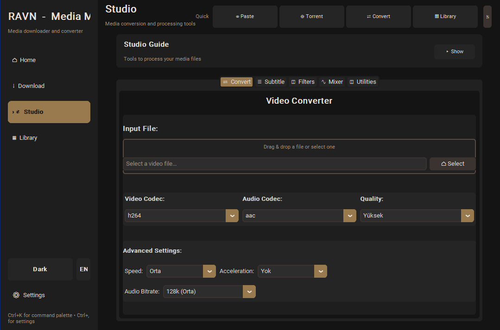
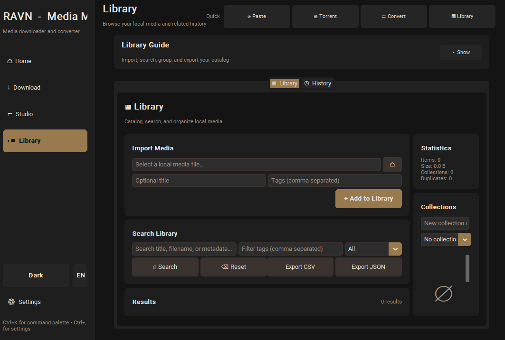

<p align="center">
  
</p>

<p align="center">
  
</p>

<h1 align="center">RAVN</h1>

<p align="center">
  Desktop + CLI media app for downloading, converting, organizing, and reviewing media on Windows.
</p>

<p align="center">
  <a href="https://github.com/waldseelen/ravn/releases"></a>
  <a href="https://github.com/waldseelen/ravn/releases"></a>
  <a href="https://github.com/waldseelen/ravn/actions/workflows/windows-package.yml"></a>
</p>

<p align="center">
  
  
  
  
</p>

<p align="center">
  <a href="https://github.com/waldseelen/ravn/releases">Download the latest Windows build</a>
</p>

---

## What is RAVN?

RAVN is a Windows-first media workstation that combines four things in one app:

- **Download** videos, audio, playlists, batches, magnets, and `.torrent` files
- **Process** media with FFmpeg-backed conversion, filters, subtitles, mixer, and utilities
- **Organize** outputs in a local library with history and queue tracking
- **Automate** the same core flows from the command line

It is built around a desktop UI, a shared-core CLI, queue/history persistence, bundled-runtime packaging, and a practical Windows release flow.

---

## Screenshots

<p align="center">
  
  
</p>
<p align="center">
  
  
</p>

---

## Highlights

### Unified download workspace
- one smart source bar for:
  - media URLs
  - playlists
  - batch links
  - magnets
  - `.torrent` files
- automatic source detection with manual override
- shared **Video / Audio** output switching
- staged playlist loading with selective download controls

### Media processing toolkit
- convert video and audio formats
- embed and process subtitles
- apply FFmpeg filters
- mix audio and video workflows
- use utility helpers like remux, trim, thumbnail, loudnorm, blackdetect, scene preview, and more

### Queue, history, and library
- background task queue
- persisted history for downloads and processing operations
- local media library with tags, collections, search, and export
- optional auto-add of successful outputs into the media library

### Windows-focused packaging
- packaged Windows build flow via PyInstaller
- bundled FFmpeg / FFprobe runtime strategy
- release zip + SHA256 artifacts
- GitHub Actions packaging and tagged release publishing

---

## Main product areas

### Download
- single URL downloads
- playlist review and partial selection
- batch URL downloads
- torrent and magnet handling through aria2
- quality / format selection
- subtitle preferences and embedding
- post-download automation
- reusable acquisition profiles

### Studio
- **Convert**
- **Subtitle**
- **Filters**
- **Mixer**
- **Utilities**

### Library
- local media catalog
- aggregated activity history
- search, tags, collections, export

### CLI
- shared-core scripting access for download, convert, history, torrent, mixer, filters, utilities, and library actions

---

## Download the app

### Windows packaged build

RAVN currently targets **Windows packaged releases**.

Pre-release and release artifacts are published on GitHub Releases and include:

- `RAVN-windows-x64.zip`
- `RAVN-windows-x64.sha256.txt`

If SmartScreen appears, that is expected for unsigned or newly released builds. See the signing note below.

---

## Quick start

### Option 1: Run from source

```bash
pip install -r requirements.txt
python ravn.py
```

### Option 2: Install editable package

```bash
pip install -e .
python ravn.py
```

### CLI examples

```bash
python -m ravn_app.cli download "https://example.com/video" --profile archive --subtitle-lang en --postprocess-embed-subtitles --json
python -m ravn_app.cli convert input.mp4 --format mkv --quality high
python -m ravn_app.cli torrent "magnet:?xt=urn:btih:..." --sequential
ravn library search --query video --format mp4 --tags tutorial --json
ravn utilities input.mp4 --operation thumbnail --output thumb.jpg
```

---

## Dependencies

### Required
- Python 3.9+
- FFmpeg
- FFprobe
- yt-dlp
- Python packages from `requirements.txt`

### Optional
- `aria2c` for torrent / magnet support
- `tkinterdnd2` for drag-and-drop

Install Python dependencies:

```bash
pip install -r requirements.txt
```

Example `aria2` installs:

```bash
winget install aria2
brew install aria2
sudo apt install aria2
```

For dependency troubleshooting and setup details, see **[DEPENDENCIES.md](DEPENDENCIES.md)**.

---

## Desktop workspaces

### Home
- quick actions
- tool/dependency health summary
- recent activity and queue context

### Download
- smart source routing
- media / playlist / batch / torrent flows
- profile-driven acquisition controls

### Studio
- conversion, subtitle, filters, mixer, utilities

### Library
- media library browsing
- history review
- search and export workflows

---

## Release status

Current public release track:

- Windows packaged builds are published through GitHub Releases
- tagged releases can publish `zip` + `SHA256` artifacts automatically
- tags that include a hyphen, such as `v1.1.0-rc2`, publish as **GitHub prereleases**
- bundled FFmpeg / FFprobe runtime lookup is supported in packaged Windows builds
- Windows child tool console popups are suppressed on the main GUI runtime paths

Latest validated automated test baseline:

- `pytest -q` → `644 passed, 1 skipped`

For the validated implementation snapshot, see **[PROGRESS.md](PROGRESS.md)**.

---

## Build and packaging

Local Windows packaging uses:

- `build.ps1`
- `ravn.spec`
- `.github/workflows/windows-package.yml`
- `.github/workflows/windows-release.yml`

Typical commands:

```powershell
./build.ps1 -Action check
./build.ps1 -Action package
./build.ps1 -Action ci-package -DownloadBundledFFmpeg
```

Smoke validation helper:

```powershell
pwsh -ExecutionPolicy Bypass -File .\tools\windows_package_smoke.ps1 -PackageRoot .\dist\RAVN
```

Detailed packaging notes live in **[docs/phase5f_windows_packaging.md](docs/phase5f_windows_packaging.md)**.

---

## SmartScreen and code signing

Public Windows builds can still show **SmartScreen** warnings if they are unsigned or newly published.

Current practical guidance:

- download only from GitHub Releases
- verify the included SHA256 checksum
- use prereleases for early validation when needed
- long-term, use a **code-signing certificate** for stronger Windows trust and clearer publisher identity

## Known limitations

- Windows is the primary packaged-release target right now
- public builds may still trigger SmartScreen until code signing is added and reputation builds over time
- torrent reliability still depends on peer / tracker availability and local network conditions

---

## Documentation

### User and operator docs
- [DEPENDENCIES.md](DEPENDENCIES.md) — setup, required tools, and troubleshooting
- [docs/phase5f_windows_packaging.md](docs/phase5f_windows_packaging.md) — Windows packaging, release workflow, smoke validation, and signing notes
- [PROGRESS.md](PROGRESS.md) — validated repository snapshot

### Engineering docs
- [ARCHITECTURE.md](ARCHITECTURE.md) — runtime flows and module boundaries
- [TASKS.md](TASKS.md) — active backlog and release-readiness plan
- [OPTIMIZATIONS.md](OPTIMIZATIONS.md) — optimization closeout notes

---

## Repository layout

```text
ravn.py
build.ps1
ravn.spec
ravn_app/
  cli.py
  core/
  ui/
  translations/
  utils/
docs/
tests/
tools/
```

Canonical active desktop feature imports live under:

- `ravn_app.ui.tabs.*`

---

## Development and testing

Useful commands:

```bash
pytest -q
pytest -q tests/test_ui_logic.py
pytest -q tests/test_ui_components.py tests/test_app_builder.py
pytest -q tests/test_config_paths.py tests/test_database_manager.py
```

---

## License

Add your preferred license information here if / when the project is published under a formal license.
